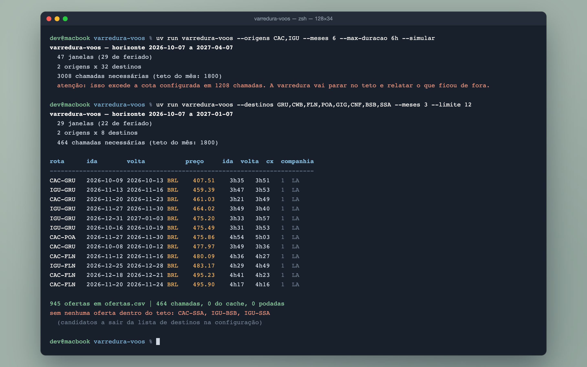
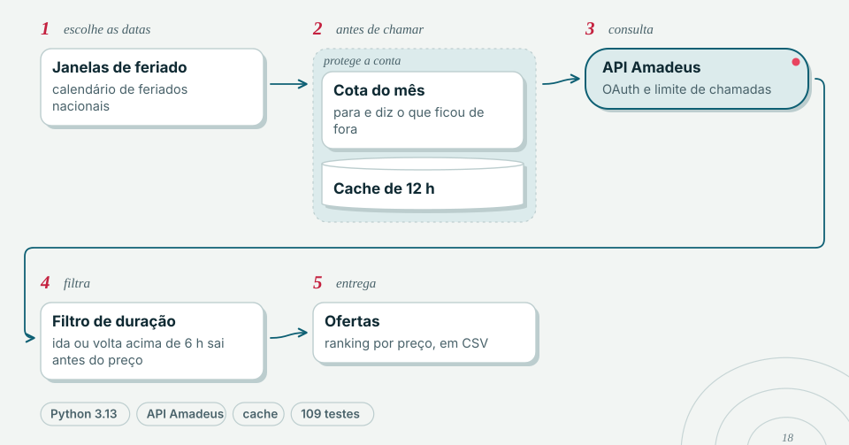

<picture>
  <source media="(prefers-color-scheme: dark)" srcset="docs/marca/cabecalho-escuro.svg">
  
</picture>

# varredura-voos

Varre preços de passagens aéreas nacionais saindo do oeste do Paraná (CAC e IGU) e
devolve as melhores oportunidades de viagem curta — sempre 2 adultos, econômica, ida e
volta.



O filtro que define a ferramenta não é o preço: é a **duração**. Para uma viagem de três
noites, um itinerário de 12 horas com duas conexões inviabiliza a viagem mesmo custando
metade. Ofertas cuja ida **ou** volta ultrapasse o teto (padrão: 6h) são descartadas
antes de qualquer ranqueamento.

## Como funciona

<picture>
  <source media="(prefers-color-scheme: dark)" srcset="docs/marca/diagrama-escuro.svg">
  
</picture>

## Instalação

```bash
uv sync                 # o uv baixa o Python 3.13 se preciso
```

## Credenciais da Amadeus

1. Crie uma conta em <https://developers.amadeus.com>.
2. Em **My Self-Service Workspace**, crie uma aplicação. Ela nasce no ambiente de
   **teste**, que é gratuito.
3. Copie a **API Key** e o **API Secret**.
4. Exporte no ambiente — nunca no código, nunca em arquivo versionado:

```bash
export AMADEUS_CLIENT_ID=sua_api_key
export AMADEUS_CLIENT_SECRET=seu_api_secret
```

Há um `.env.example` como referência. `.env` está no `.gitignore`.

## Uso

```bash
# quanto vai custar em chamadas, sem gastar nenhuma
uv run varredura-voos --origens CAC,IGU --meses 6 --max-duracao 6h --simular

# a varredura de verdade
uv run varredura-voos --origens CAC,IGU --meses 6 --max-duracao 6h --saida ofertas.csv
```

Opções úteis:

| flag | efeito |
|---|---|
| `--simular` | conta as chamadas necessárias e sai. Rode sempre antes. |
| `--destinos GRU,CWB,FLN` | restringe a lista de destinos desta execução |
| `--max-chamadas 500` | teto de chamadas neste mês, sobrepondo a configuração |
| `--poda-agressiva` | corta rotas longas com estimativa realista (veja a ressalva) |
| `--max-duracao 6h30` | outro teto por perna (`6h`, `6h30`, `90m`) |
| `--producao` | usa a API de produção em vez da de teste |

## A cota é o gargalo — leia antes de rodar

O ambiente de teste é gratuito, mas tem **cota mensal**. Medido com `--simular` em
29/08/2026: um horizonte de 6 meses gera **45 janelas** (28 delas de feriado) e, com
2 origens × 32 destinos, pede **2.880 chamadas** — o suficiente para queimar o mês
inteiro numa execução só. Rode `--simular` sempre: o número muda com o horizonte e com
os feriados que caem dentro dele.

Três mecanismos existem por causa disso:

- **Orçamento** (`estado/cota.json`) conta as chamadas por mês-calendário. Ao bater o
  teto, a varredura **para e diz o que ficou de fora** — em vez de morrer com erro de
  cota no meio.
- **Prioridade**: as janelas de feriado são varridas primeiro. Se a cota acabar, o que
  fica de fora é a parte menos valiosa.
- **Cache** (`estado/cache/`, TTL de 12h) faz uma segunda execução no mesmo dia custar
  zero chamada.

Confira sua cota real em *My Self-Service Workspace → API usage and quota*, e ajuste
`max_chamadas_mes` na configuração.

Limites de ritmo, [conforme a documentação](https://amadeus4dev.github.io/developer-guides/api-rate-limits/):
10 transações por segundo no teste, 40 em produção, e no máximo 1 requisição a cada
100 ms nos dois. A ferramenta respeita ambos.

## Configuração

Tudo que muda de tempos em tempos vive em TOML, não no código: origens, destinos,
coordenadas dos aeroportos, rotas diretas, tetos e parâmetros de estimativa.

O padrão embarcado é `src/varredura_voos/dados/varredura.toml`. Para editar sem mexer no
pacote, copie para `config/varredura.toml` no diretório de onde você roda — ele tem
precedência. Ou aponte um arquivo com `--config`.

Os feriados **não** ficam em tabela: são derivados em runtime pela lib `holidays` (BR),
nas categorias `PUBLIC` **e** `OPTIONAL`. As duas são obrigatórias — o Carnaval é ponto
facultativo e não aparece em `PUBLIC`. A tabela apurada de 2026–2027 vive em
`tests/test_janelas.py` como fixture de regressão contra a lib.

## Como ler a saída

O CSV sai ordenado por preço crescente, com uma linha por oferta aprovada:

| coluna | significado |
|---|---|
| `preco_total` | total para **os 2 adultos**, já com taxas (`grandTotal` da API) |
| `duracao_ida` / `duracao_volta` | porta a porta do avião, formato `5h30` |
| `conexoes_ida` / `conexoes_volta` | trocas de avião — **não** é o `numberOfStops` da API, que conta parada técnica |
| `motivo` | por que essa janela foi varrida (`feriado: Natal`, `fim de semana`) |

No terminal saem as 15 melhores, e no rodapé três números que importam:
chamadas gastas, servidas pelo cache e podadas.

A linha **"sem nenhuma oferta dentro do teto"** lista pares origem-destino que
responderam mas nunca produziram nada aproveitável. São os candidatos naturais a sair da
lista de destinos — poda com dado medido, em vez de palpite.

## Duas ressalvas honestas

**A poda geográfica quase não economiza cota.** A ideia era descartar rotas impossíveis
antes de gastar chamada, estimando um limite inferior de duração. Medido: com conexão
mínima de 45 min e 800 km/h, **nenhum** dos 64 pares é podado num teto de 6h — até
`CAC→MAO` dá 5,75h no melhor caso concebível. O limite inferior honesto é frouxo demais
para cortar. `--poda-agressiva` usa conexão de 90 min e corta ~20% dos pares, mas deixa
de ser limite inferior e **pode esconder oferta de borda**. Por isso vem desligada.
Quem controla a cota de fato é o orçamento, não a geografia.

**O Flight Inspiration Search não serve para CAC nem IGU.** Ele roda sobre um cache das
rotas mais buscadas. Há
[relato de `ORIGIN AND DESTINATION NOT SUPPORTED` até para BER e FCO](https://github.com/amadeus4dev/amadeus-node/issues/199);
aeroportos do porte de Cascavel não têm chance. A varredura itera sobre a lista explícita
de destinos, e a chamada de inspiração, quando falha, é ignorada sem interromper nada.

Some-se a isso que o ambiente de teste devolve **dados em cache das rotas mais buscadas**,
não inventário real. É possível que CAC devolva vazio mesmo com cota disponível — vazio e
"não coberto" são indistinguíveis pela resposta. Rode `--simular` e depois uma varredura
pequena (`--destinos GRU --meses 1`) antes de comprometer a cota do mês.

## Desenvolvimento

```bash
uv run pytest --cov=varredura_voos    # 109 testes, nenhum toca a rede
uv run ruff check . && uv run ruff format --check .
uv run mypy                            # --strict, configurado no pyproject
```

Nenhum módulo executa efeito colateral no import: sem I/O, sem leitura de ambiente, sem
criação de cliente HTTP e sem configuração de logging em nível de módulo. O cliente
`httpx` é injetado por parâmetro, e os testes o substituem por `MockTransport` — exceto
`tests/test_integracao_cli.py`, que sobe um servidor HTTP real em localhost para exercer
o caminho completo da CLI, incluindo OAuth2 e retry.

## Status

Funcional e testado (109 testes, sem rede). Ambiente de teste da Amadeus por padrão;
`--producao` para inventário real. Uso pessoal.
